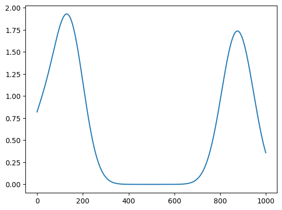
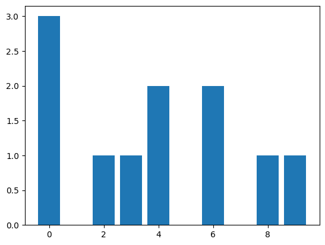

`2023-10-22 16:17:42`: downald some data, and use a pipeline to see if there exists any common attributes.
almost  all files has `trial` and `units`, which represents the trial-info and spikes info.
furthere more, in `trial` table, the `start_time` and `stop_time` segment always exists.
and in `units`, the `spike_time` always exists.

however, some file does not have `trial` ?


`2023-10-22 20:52:58`:
so, now we can be sure that after the spike trials, the data recorded in the file .nwb, which
can be read use **`pynwb`** code-set.
however, now we would like to use `Elephant` --- a spike data read-analysis tools to read it.


`2023-10-23 19:47:26`:
测试发现, 需要安装 pynwb 包. 另一方面测试了对 nev 文件的支持, 发现可以很好的读取.

`2023-10-23 21:18:43`:
封装的 NWBIO() 会报错.

`2023-10-23 21:19:59`:
开始尝试 python 库的制作.

`2023-10-23 21:42:52`:
接下来需要为这个库进行需求分析和定位.

`2023-10-23 21:48:12`:
https://elephant.readthedocs.io/en/latest/reference/statistics.html
先看 elephant 中关于 spike-trains 的分析.
#### 1. Rate estimation
* **`mean_firing_rate`**(`spiketrain`, `t_start`=None, `t_stop`=None, `axis`=None)
  Return the firing rate of the spike train.
  * `spiketrain` : neo.SpikeTrain or pq.Quantity or np.ndarray. The spike times.
  * `t_start` : float or pq.Quantity, optional. The start time to use for the interval.
  * `t_stop` : float or pq.Quantity, optional

---

* **`instantaneous_rate`**(`spiketrains`, `sampling_period`, `kernel`='auto', `cutoff`=5.0, `t_start`=None, `t_stop`=None, `trim`=False, `center_kernel`=True, `border_correction`=False). Estimates instantaneous firing rate by kernel convolution.
  * `spiketrains` : neo.SpikeTrain or list of neo.SpikeTrain
  * `sampling_period` : pq.Quantity
    Time stamp resolution of the spike times. The same resolution will be assumed for the kernel.
  *  `kernel` : 'auto' or Kernel, optional
    The string 'auto' or callable object of class `kernels.Kernel`. The kernel is used for convolution with the spike train and its standard deviation determines the time resolution of the instantaneous rate estimation. Currently, implemented kernel forms are rectangular, triangular, epanechnikovlike, gaussian, laplacian, exponential, and alpha function.

仅从 `instantaneous_rate` 功能含义看, 它只需要前两个参数即可, 一个指明了发放序列, 另一个规定了计算时的bin宽度.
然而, 该函数似乎还做了一种平滑性的处理
```py
import neo
import quantities as pq
from elephant import statistics
spiketrain = neo.SpikeTrain([0.1, 1.2, 1.4, 1.52, 8.5, 8.7, 9.1], t_stop=10, units='s')
rate = statistics.instantaneous_rate(spiketrain, sampling_period=10 * pq.ms, kernel='auto')

import matplotlib.pyplot as plt
plt.plot(rate.magnitude.flatten())
plt.show()
```



* **`time_histogram`**(spiketrains, bin_size, t_start=None, t_stop=None, output='counts', binary=False). Time Histogram of a list of `neo.SpikeTrain` objects.
    * `spiketrains` : list of neo.SpikeTrain
        `neo.SpikeTrain`s with a common time axis (same `t_start` and `t_stop`)
    * `bin_size` : pq.Quantity
        Width of the histogram's time bins.
```py
spiketrains = [
    neo.SpikeTrain([0.3, 4.5, 6.7, 9.3], t_stop=10, units='s'),
    neo.SpikeTrain([0.7, 4.3, 8.2], t_stop=10, units='s'),
    neo.SpikeTrain([0.1, 2.3, 3.5, 6.2], t_stop=10, units='s')
]
hist = statistics.time_histogram(spiketrains, bin_size=1 * pq.s)
b = hist.magnitude.flatten()
x = list(range(b.shape[0]))
plt.bar(x, b)
```


#### 2. Spike interval statistics
* **`isi`**(spiketrain, axis=-1)
    Return an array containing the inter-spike intervals of the spike train.
    Accepts a `neo.SpikeTrain`, a `pq.Quantity` array, a `np.ndarray`, or a list of time spikes.
```py
sp = np.array([0.2, 1.3, 2.1, 2.3, 2.45, 2.53, 4.7, 6.3, 9.4])
statistics.isi(sp)
"""
array([1.1 , 0.8 , 0.2 , 0.15, 0.08, 2.17, 1.6 , 3.1 ])
"""
```
---
* **`cv`**(a, axis=0, nan_policy='propagate', ddof=0, *, keepdims=False)
变异系数（Coefficient of Variation）：当需要比较两组数据离散程度大小的时候，如果两组数据的测量尺度相差太大，或者数据量纲的不同，直接使用标准差来进行比较不合适，此时就应当消除测量尺度和量纲的影响，而变异系数可以做到这一点，它是原始数据标准差与原始数据平均数的比。CV没有量纲，这样就可以进行客观比较了。事实上，可以认为变异系数和极差、标准差和方差一样，都是反映数据离散程度的绝对值。其数据大小不仅受变量值离散程度的影响，而且还受变量值平均水平大小的影响。在概率论和统计学中，变异系数，又称“离散系数”（英文：coefficient of variation），是概率分布离散程度的一个归一化量度，其定义为**标准差与平均值之比**.
* `a` : array_like, Input array.
* `axis` : int or None, optional, Axis along which to calculate the coefficient of variation. Default is 0. If None, compute over the whole array `a`.
* `nan_policy` : {'propagate', 'raise', 'omit'}, optional. The default is 'propagate'. Defines how to handle when input contains ``nan``.The following options are available:
  * 'propagate': return ``nan``
  * 'raise': raise an exception
  * 'omit': perform the calculation with ``nan`` values omitted
* `ddof` : int, optional. Gives the "Delta Degrees Of Freedom" used when computing the standard deviation.  The divisor used in the calculation of the standard deviation is ``N - ddof``, where ``N`` is the number of elements.  `ddof` must be less than ``N``; if it isn't, the result will be ``nan`` or ``inf``, depending on ``N`` and the values in the array.  By default `ddof` is zero for backwards compatibility, but it is recommended to use ``ddof=1`` to ensure that the sample standard deviation is computed as the square root of the unbiased sample variance.
* `keepdims` : bool, optional. If this is set to True, the axes which are reduced are left in the result as dimensions with size one. With this option, the result will broadcast correctly against the input array.
* Returns:
    * variation : ndarray, The calculated variation along the requested axis.
```py
statistics.cv(sp)
# 0.7747676238998964
```

* **`cv2`**
**`cv2`**(time_intervals, with_nan=False) Calculate the measure of Cv2 for a sequence of time intervals between events :cite: `statistics-Holt1996_1806`.
$\frac{1}{N} \sum_{i=1}^{N-1}\frac{2|I_{i+1}-I_i|}{|I_{i+1}+I_i|}$

* **`lv`**
**`lv`**(time_intervals, with_nan=False) Calculate the measure of **local variation Lv** for a sequence of time intervals between events :cite: `statistics-Shinomoto2003_2823`.
The Lv is typically computed as a substitute for the classical coefficient of variation for sequences of events which include some (relatively slow) rate fluctuation.
$\frac{1}{N} \sum_{i=1}^{N-1}\frac{3(I_i-I_{i+1})^2}{(I_i+I_{i+1})^2}$

* **`lvr`**
**`lvr`**(time_intervals, R=array(5.) * ms, with_nan=False) Calculate the measure of revised local variation LvR for a sequence of time intervals between events :cite:`statistics-Shinomoto2009_e1000433`.
$\frac{3}{N-1} \sum_{i=1}^{N-1}\left(1-\frac{4 I_i I_{i+1}}{(I_i+I_{i+1})^2}\right)\left(1+\frac{4 R}{I_i+I_{i+1}}\right)$

### Statistics across spike trains
* **`fanofactor`**
`fanofactor`(spiketrains, warn_tolerance=array(0.1) * ms)
The Fano factor is typically computed for spike trains representing the activity of the same neuron over different trials. **The higher F, the larger the cross-trial non-stationarity.**
```py
import neo
from elephant import statistics
spiketrains = [
    neo.SpikeTrain([0.3, 4.5, 6.7, 9.3], t_stop=10, units='s'),
    neo.SpikeTrain([1.4, 3.3, 8.2], t_stop=10, units='s')
]
statistics.fanofactor(spiketrains)
# 0.07142857142857142
```
https://www.zhihu.com/question/316473144

-----
* **`complexity_pdf`**
`complexity_pdf`(spiketrains, bin_size)
Deprecated in favor of Complexity.pdf().
Probability density computed from the complexity histogram which is the histogram of the entries of the population histogram of clipped (binary) spike trains computed with a bin width of bin_size. 

---
* **`Complexity`**
`class elephant.statistics.Complexity(spiketrains, sampling_rate=None, bin_size=None, binary=True, spread=0, tolerance=1e-08)[source]`
Class for complexity distribution of a list of neo.SpikeTrain objects.

Complexity is calculated by counting the number of spikes (i.e. non-empty bins) that occur separated by spread - 1 or less empty bins, within and across spike trains in the spiketrains list.

> Sonja Grün, Moshe Abeles, and Markus Diesmann. Impact of higher-order correlations on coincidence distributions of massively parallel data. In International School on Neural Networks, Initiated by IIASS and EMFCSC, volume 5286, 96–114. Springer, 2007.

先不看理论, 单从代码运行结果看, 在 spread=0 的时候, time_histogram 就是bin处理后的发放数分布, complexity_histogram 指明了发放数为(0, 1, 2, ......)的bin数量.

```py
sampling_rate = 1/pq.ms
st1 = neo.SpikeTrain([2, 3, 5, 7] * pq.ms, t_stop=10.0 * pq.ms)
st2 = neo.SpikeTrain([1, 2, 5, 8] * pq.ms, t_stop=10.0 * pq.ms)
sts = [st1, st2]
>>> print(cpx.time_histogram.flatten())
# [0 1 2 1 0 2 0 1 1 0] dimensionless
>>> cpx.complexity_histogram
# array([4, 4, 2], dtype=int64)
```

假如 spread=1, 计算 "consecutive spikes" 的bin数量. 对于 `[2, 4, 6, 7]` 和 `[1, 2, 5, 8]`, 有:
```
[1, 2, 2, 4, 5, 6, 7, 8]
bin=0, 没有发放, 故为 0
bin=1, 有发放, 且在 bin=2 处发放 2 次, 故为 3
bin=2, 有发放, 且在 bin=1 处发放 1 次, 故为 3
bin=3, 没有发放, 故为 0
bin=4, 有发放, 且在 bin=5678 处各发放 1 次, 故为 5
... ...

则:
time_histogram=[0 3 3 0 5 5 5 5 5 0]
而 complexity_histogram 则这样计算, time_histogram 简记为 th:
th[i]=0 的有 3 个, complexity_histogram[0]=3
th[i]=1 的有 0 个, complexity_histogram[1]=0
th[i]=2 的有 0 个, complexity_histogram[2]=0
th[i]=3 的有 2 个, 但他们属于同一个连续块, complexity_histogram[3]=1
th[i]=4 的有 0 个, complexity_histogram[4]=0
th[i]=5 的有 5 个, 但他们属于同一个连续块, complexity_histogram[0]=1
则:
complexity_histogram = [3, 0, 0, 1, 0, 1]
```

再举例, 输入为 `[1 4 5 8 9]` 和 `[1 2 4 6 8]`
则输出是:
```
time_histogram=[0 3 3 0 4 4 4 0 3 3]
complexity_histogram=[3 0 0 2 1]
```

`spread = 2`, consecutive spikes and separated by 1 empty bin
对于 [1 4 6] 和 [1 5 8], 有:
```py
complexity_histogram = [4 0 1 0 1]
time_histogram = [0 2 0 0 4 4 4 4 4 0]
```


`2023-10-24 21:59:45`:
看完了所有的统计分析指标. 若有所思.


`2023-10-24 22:06:59`:
接下来需要再继续看一下关于 参数类型设置的问题, 如何接收多种不同类型的参数?
例如 time_histogram, 可以深入探讨一下

`2023-10-25 10:40:39`:
通过文档注释来实现这一功能
```py
def adder(a, b):
    """
    add a and b, return the result

    Parameters
    ----------
    a: int or float
    b: int or float

    Returns
    -------
    int or float
        a number representing the result of a+b

    Examples
    --------
    >>> adder(2, 3.5)
    >>> 5.5
    """
    return a+b
```


